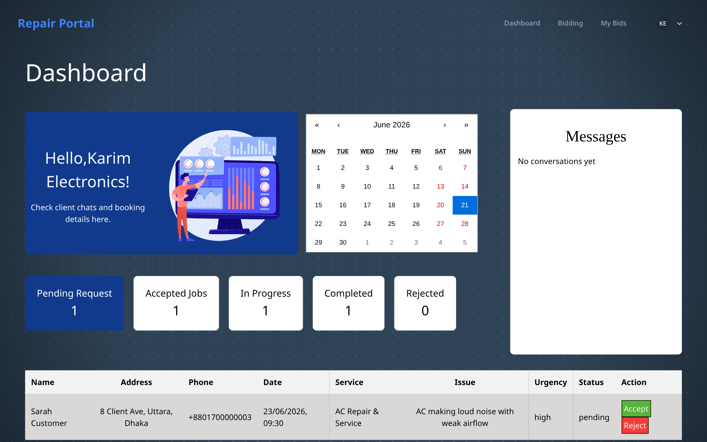

# Repair Portal

Repair Portal is a marketplace that connects people who need repairs with technicians who can do the work. Customers describe a problem, get an AI-assisted diagnosis, book a service or take bids from technicians, pay through the platform, and chat with their technician in real time. Technicians manage incoming requests, bid on jobs, and build a review history. Admins oversee the catalog and users.

The project runs on a single SQLite database, so there is no external database server to set up. It is meant to be cloned and running in a few minutes.

## Screenshot



## Features

- Email and password accounts with three roles: customer, technician, and admin (JWT auth).
- Searchable catalog of repair services with categories and price estimates.
- Technician search and profiles.
- Service booking with photo uploads so technicians have context before accepting.
- Live booking status (pending, accepted, completed, cancelled) with real-time notifications.
- Technician bidding as an alternative to direct booking.
- AI repair diagnosis using Google Gemini, from a text description and optional images.
- Payments with a configurable platform fee.
- PDF invoice generation and warranty cards with QR codes.
- Ratings and reviews after a completed job.
- Real-time chat between customers and technicians over Socket.io.
- Admin dashboard for managing services and users.
- Security defaults: Helmet headers, request rate limiting, bcrypt password hashing, and soft deletes.

## Installation

### Prerequisites

- Node.js 18 or newer and npm.
- A C/C++ toolchain for building `better-sqlite3` (most systems already have this; on Linux install `build-essential`, on macOS install the Xcode command line tools).
- A Google Gemini API key if you want the AI diagnosis feature ([get one here](https://aistudio.google.com/app/apikey)).

### Clone the repository

```bash
git clone https://github.com/lubdhak7414/Repair-Portal-AI.git
cd Repair-Portal-AI
```

### Install dependencies

Backend dependencies live in the root `package.json`; frontend dependencies live in `frontend/`. Install both:

```bash
npm install
npm install --prefix frontend
```

### Environment variables

Copy the example files and fill in the values that matter to you:

```bash
cp .env.example .env
cp frontend/.env.example frontend/.env
```

At minimum, set `JWT_SECRET` in `.env`. Set `GEMINI_API_KEY` too if you plan to use AI diagnosis. See [Configuration](#configuration) for the full list.

### Database setup

The SQLite file is created automatically the first time the backend starts, and the schema in `backend/config/schema.sql` is applied on connect. There is no separate migration step.

To load sample data (services, technicians, bookings, and a few test accounts):

```bash
npm run seed
```

The seed script prints login credentials when it finishes, for example `admin@repairportal.com / admin123`. It refuses to run when `NODE_ENV=production`.

### Build steps

The backend runs directly from source. The frontend needs a build for production:

```bash
npm run build --prefix frontend
```

For local development you do not need to build; the dev server handles it.

## Configuration

Backend variables go in `.env` at the project root.

| Variable               | Description                                                | Required |
| ---------------------- | ---------------------------------------------------------- | -------- |
| `PORT`                 | Backend server port. Defaults to `3000`.                   | No       |
| `JWT_SECRET`           | Secret used to sign JWT auth tokens.                       | Yes      |
| `GEMINI_API_KEY`       | Google Gemini API key for AI diagnosis.                    | For AI   |
| `DB_PATH`              | SQLite file path. Defaults to `backend/data/repair-portal.db`. | No   |
| `CORS_ORIGIN`          | Allowed frontend origin. Defaults to `http://localhost:5173`. | No    |
| `PLATFORM_FEE_PERCENT` | Platform fee percentage on payments. Defaults to `5`.      | No       |

Frontend variables go in `frontend/.env`.

| Variable          | Description                                          | Required |
| ----------------- | --------------------------------------------------- | -------- |
| `VITE_API_URL`    | Backend API base URL, including `/api`.             | Yes      |
| `VITE_SOCKET_URL` | Socket.io server URL for real-time chat.            | Yes      |

To generate a strong `JWT_SECRET`:

```bash
node -e "console.log(require('crypto').randomBytes(32).toString('hex'))"
```

## Usage

Run the backend and frontend together from the project root:

```bash
npm run dev
```

This starts the API on `http://localhost:3000` and the Vite dev server on `http://localhost:5173`. Open the frontend URL in a browser.

If you seeded the database, you can sign in with one of the sample accounts:

| Role     | Email                      | Password   |
| -------- | -------------------------- | ---------- |
| Admin    | `admin@repairportal.com`   | `admin123` |
| Customer | `john@example.com`         | `user123`  |
| Technician | `karim@example.com`      | `tech123`  |

You can also call the API directly. Register a user and log in:

```bash
# Register
curl -X POST http://localhost:3000/api/users/ \
  -H "Content-Type: application/json" \
  -d '{"name":"Alice","email":"alice@example.com","phone":"+12025550123","password":"pass1234"}'

# Log in (returns a token and user object)
curl -X POST http://localhost:3000/api/users/login \
  -H "Content-Type: application/json" \
  -d '{"email":"alice@example.com","password":"pass1234"}'
```

Use the returned token as a Bearer header on protected routes:

```bash
curl http://localhost:3000/api/services \
  -H "Authorization: Bearer <token>"
```

Back up the SQLite database at any time:

```bash
npm run backup-db
```

## Updating

Pull the latest code and refresh everything:

```bash
# 1. Get the latest changes
git pull

# 2. Update dependencies (root and frontend)
npm install
npm install --prefix frontend

# 3. No migrations to run. The schema is applied from
#    backend/config/schema.sql on startup, and existing tables
#    are left in place.

# 4. Rebuild the frontend for production
npm run build --prefix frontend
```

If a future change alters table structure, back up first with `npm run backup-db`, since there is no automated migration tool.

## Development

Install dependencies as shown above, then:

### Development server

```bash
npm run dev
```

Runs the API with `nodemon` (auto-restart on change) and the Vite dev server with hot module reload.

### Testing

Backend integration tests use Vitest and Supertest. They run against a temporary SQLite database in your system temp directory, so they never touch your real data.

```bash
npm test          # run once
npm run test:watch # watch mode
```

### Linting

ESLint is configured for the frontend:

```bash
npm run lint
```

### Formatting

> TODO: no formatter (such as Prettier) is configured in the repo. Add one if you want consistent formatting across contributors.

## Project Structure

```text
.
├── backend/
│   ├── app.js              # Express app (middleware, routes, error handler), exported for tests
│   ├── server.js           # HTTP server + Socket.io wiring + listen
│   ├── config/             # SQLite connection and schema.sql
│   ├── controllers/        # Request handlers per domain (users, bookings, payments, ...)
│   ├── middleware/         # auth, validation, error handling, file upload
│   ├── models/             # SQLite data access (synchronous, better-sqlite3)
│   ├── routes/             # Route groups mounted under /api via index.js
│   ├── validators/         # Joi request schemas
│   ├── services/           # Cross-cutting helpers (event emitter)
│   ├── scripts/            # seed and backup-db
│   ├── tests/              # Vitest + Supertest integration tests
│   ├── data/               # SQLite database file (gitignored)
│   └── uploads/            # Generated invoices, warranties, booking images
└── frontend/
    └── src/
        ├── components/     # App and shadcn/ui components
        ├── context/        # Auth, socket, and protected-route providers
        ├── lib/            # axios api client
        ├── pages/          # Route pages
        ├── sections/       # Landing page sections
        ├── services/       # Per-domain API call modules
        └── main.jsx        # Router and app entry
```

API route groups (all under `/api`): `users`, `bookings`, `services`, `technicians`, `payments`, `reviews`, `invoices`, `warranties`, `messages`, `bids`, `diagnosis`.

## Deployment

This is a standard Node API plus a static frontend build.

1. Set production environment variables. At minimum `JWT_SECRET`, plus `CORS_ORIGIN` pointing at your real frontend domain, and `NODE_ENV=production`.
2. Point `DB_PATH` at a file on persistent storage (a mounted volume, not an ephemeral container layer), since all data lives in that single SQLite file.
3. Start the API with `npm start` (or run `backend/server.js` under a process manager such as pm2 or a systemd unit).
4. Build the frontend with `npm run build --prefix frontend` and serve `frontend/dist` from a static host or a reverse proxy (nginx, Caddy) in front of the API.
5. Schedule `npm run backup-db` to copy the database on a regular basis.

Notes for production:

- Rate limiting and Helmet are on by default.
- Run behind HTTPS (terminate TLS at your reverse proxy or load balancer).
- SQLite handles modest concurrency well. If you expect heavy parallel writes, plan accordingly, since writes are serialized.

## Troubleshooting

**`better-sqlite3` fails to install or load.**
It compiles a native module. Make sure you have a build toolchain (`build-essential` on Linux, Xcode command line tools on macOS). After upgrading Node, run `npm rebuild better-sqlite3`.

**Backend exits with "Cannot open database because the directory does not exist".**
The `backend/data/` directory is gitignored and may be missing on a fresh clone. Create it with `mkdir -p backend/data`, or just run `npm run seed`, which creates it.

**Frontend cannot reach the API or CORS errors appear.**
Check that `VITE_API_URL` in `frontend/.env` matches where the backend runs, and that `CORS_ORIGIN` in `.env` matches the frontend origin.

**AI diagnosis returns an error.**
Confirm `GEMINI_API_KEY` is set and valid. The `/api/diagnosis` route is rate limited to 5 requests per minute, so rapid retries return a 429.

**Login works but a request returns 401.**
Tokens expire after one hour. Log in again to get a fresh token.

## FAQ

**Do I need MongoDB or any database server?**
No. The app uses SQLite through `better-sqlite3`. The database is a single file created on first run.

**Where is my data stored?**
In the SQLite file at `DB_PATH`, which defaults to `backend/data/repair-portal.db`.

**Can I use the app without a Gemini API key?**
Yes. Everything except AI diagnosis works without it. Diagnosis requests fail until you add a key.

**Are there automated tests?**
Yes, backend integration tests with Vitest and Supertest. Run `npm test`.

**Is there a migration system?**
No. The schema is defined in `backend/config/schema.sql` and applied on startup with `CREATE TABLE IF NOT EXISTS`. Back up before making schema changes.

## Contributing

1. Fork the repository.
2. Create a feature branch:
   ```bash
   git checkout -b feature/your-feature
   ```
3. Make your changes and commit them with a clear message:
   ```bash
   git commit -m "Add your feature"
   ```
4. Push the branch and open a pull request against `main`.

Before opening a PR, run `npm test` and `npm run lint` and make sure both pass.

## License

Released under the MIT License. See [LICENSE](./LICENSE) for the full text.

## Credits

Built with Express, Socket.io, and better-sqlite3 on the backend, and React, Vite, Tailwind CSS, and shadcn/ui on the frontend. AI diagnosis is powered by Google Gemini. Thanks to the maintainers of these projects and to everyone who contributed to Repair Portal.
